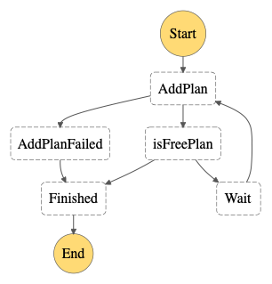
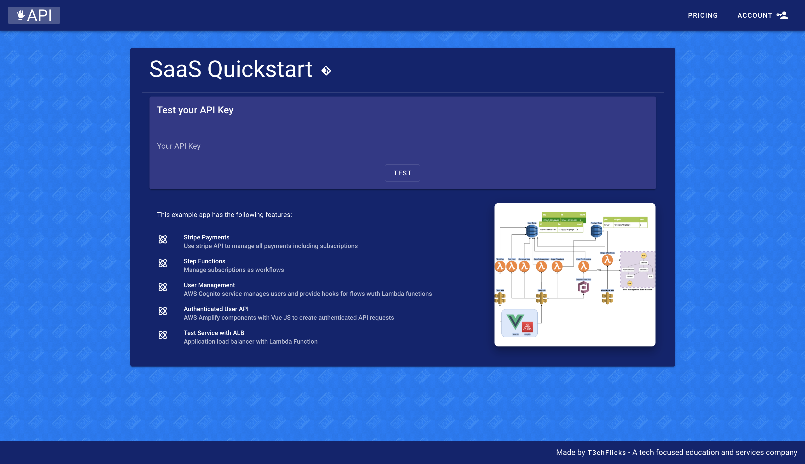
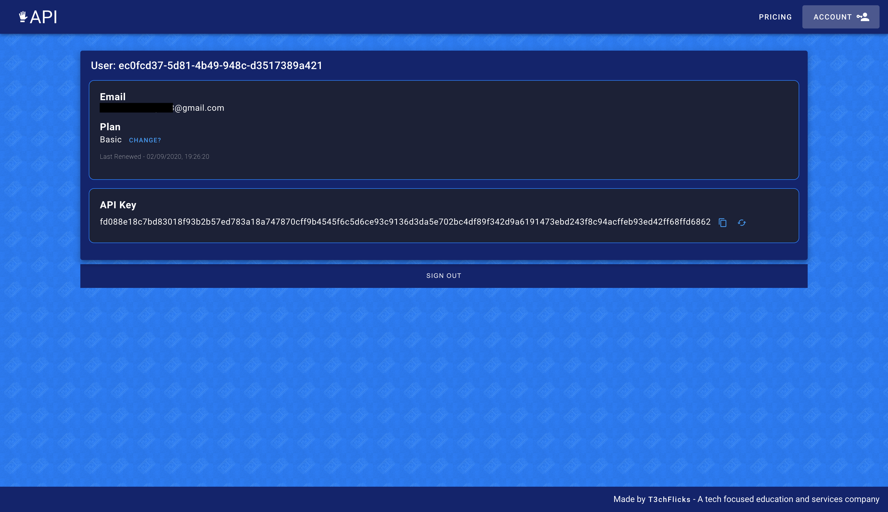

# [T3chFlicks](https://t3chflicks.org): AWS SaaS App with Stripe Quickstart
> Quickstart for running an example Sofware as a Service app on AWS allowing users to make subscriptions and payments via stripe.

[](./blog_post.md)

[](https://t3chflicks.medium.com/pay-me-quickstart-for-creating-a-saas-pt-2-stripe-payments-44bc4bb8388e)

[](https://saas-app.t3chflicks.org)


---

## Architecture 
> 

### User Management State Machine
> 

### Screenshots
Home Page

User Page

Prices Page


## Step By Step Instructions
1. This project assumes the existence of a domain hosted on Route53 and with SSL certificates for both the region of your service and US-EAST-1.
    1. [Get a domain on AWS](https://aws.amazon.com/getting-started/hands-on/get-a-domain/) 
    1. Create a [hosted zone on Route53](https://docs.aws.amazon.com/Route53/latest/DeveloperGuide/CreatingHostedZone.html)
    1. Create two [HTTPS Certificates](https://aws.amazon.com/certificate-manager/)
        * One for your region e.g. eu-west-1
        * One for cloudfront which must be us-east-1
1. Deploy `00-infra.yml` to create code bucket, certificate, and email alerts.
    * ```
        aws cloudformation deploy --template-file ./00-infra.yml --stack-name infra --region=eu-west-1  --capabilities CAPABILITY_NAMED_IAM --parameter-overrides 
        RootDomain=t3chflicks.org 
        RegionalCertArn=arn:aws:acm:eu-west-1:855097409413:certificate/73255636-c96a-4170-b86d-10261b5e3c0a 
        HostedZoneId=ZFRPCPYMXP38T 
        CloudFrontCertArn=arn:aws:acm:us-east-1:855097409413:certificate/196cda25-d956-415e-b4b6-423342b9657d
        ```
1. Deploy `01-vpc.yml` to create vpc
    * ```
        aws cloudformation deploy --template-file ./01-vpc.yml --stack-name vpc
      ```
1. Deploy `02-tables.yml` to create user and product tables
    *   ```
        aws cloudformation deploy --template-file ./02-tables.yml --stack-name tables
        ```
1. Deploy `03-user-manager.yml` and  use your own Stripe parameters to create a State Machine
    * Package AddPlan lambda and upload to bucket - the bucket name should be ~ s3://infra-codebucket-...
    * ```
        aws cloudformation deploy --template-file ./03-user-manager.yml --stack-name user-manager --region=eu-west-1  --capabilities CAPABILITY_NAMED_IAM
      ```
1. Create [Stripe](https://stripe.com) Account
    * get test API keys
1. Create Stripe products using `extra/StripeScripts/syncProducts.py`
    * using new secret test key
    * using product table name exported from previous step.
1. Deploy `04-congito.yml` to create the user pool and post confirmation functions using Stripe params
    * ```
        aws cloudformation deploy --template-file ./04-cognito.yml --stack-name cognito --region=eu-west-1  --capabilities CAPABILITY_NAMED_IAM --parameter-overrides 
        StripeSecretKey=sk_test_51HKlevJAV1tclqKuuFvkoHoOoygiavnUNDet2HXnyXd2bsNVCzvxkW2bNAA8HivobXs5idcpa5VCzK0b90wub2h100rsOtHlun
      ```
1. Deploy `05-user-api.yml` to create the user api and create functions 
    * ```
        aws cloudformation deploy --template-file ./05-user-api.yml --stack-name user-api --region=eu-west-1  --capabilities CAPABILITY_NAMED_IAM --parameter-overrides 
        StripeSecretKey=sk_test_51HKlevJAV1tclqKuuFvkoHoOoygiavnUNDet2HXnyXd2bsNVCzvxkW2bNAA8HivobXs5idcpa5VCzK0b90wub2h100rsOtHlun
      ```
1. Create Stripe web hook using `extra/StripeScripts/createWebHook.py`
    * use WebHookAPIUrl + endpoint 
1. Deploy `06-stripe-api.yml` to create webhook api 
    * add Stripe Secret key 
    * add Stripe web hook Secret
    * ```
        aws cloudformation deploy --template-file ./06-stripe-api.yml --stack-name stripe-api --region=eu-west-1  --capabilities CAPABILITY_NAMED_IAM --parameter-overrides 
        StripeSecretKey=sk_test_51HKlevJAV1tclqKuuFvkoHoOoygiavnUNDet2HXnyXd2bsNVCzvxkW2bNAA8HivobXs5idcpa5VCzK0b90wub2h100rsOtHlun  
        StripeWebHookSecret=whsec_GJx2kmziA8JG3Cjs3EVVcRZzYaD5nsmz
      ```
1. Deploy `07-test-service.yml` as an example service running on the load balancer which verifies the user request
    * ```
        aws cloudformation deploy --template-file ./07-test-api.yml --stack-name test-api --region=eu-west-1  --capabilities CAPABILITY_NAMED_IAM
      ```
1. Deploy `08-site.yml` 
    * ```
        aws cloudformation deploy --template-file ./08-site.yml --stack-name site --region=eu-west-1  --capabilities CAPABILITY_NAMED_IAM      
      ```
1. Add parameters to `frontend/src/main.js`
    * Root Domain
    * Region
    * UserApiUrl
    * TestApiUrl
    * CognitoUserPoolId
    * CognitoUserPoolClientId
1. Add parameter to `frontend/src/views/Pricing.png`
    * publishableKey from Stripe
1. Build
    * `npm run build`
1. Deploy to S3 bucket
    * ```
        aws s3 cp ./dist s3://saas-app.YOUR_DOMAIN --recursive
      ```

## Extra Info 
* [Stripe API Docs](https://stripe.com/docs/api)
* [Stripe Webooks](https://stripe.com/docs/webhooks/build)
* [Stripe Testing](https://stripe.com/docs/testing)
    * Test Card 4000058260000005	tok_gb_debit	pm_card_gb_debit	United Kingdom (GB)	Visa (debit)
* [AWS Cloudfront Region](https://docs.aws.amazon.com/AmazonCloudFront/latest/DeveloperGuide/cnames-and-https-requirements.html)
    * AWS Region that You Request a Certificate In (for AWS Certificate Manager)

---

This project was created by [T3chFlicks](https://t3chflicks.org) - A tech focused education and services company.

---
